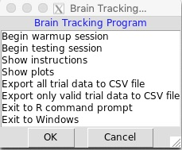

Seth Roberts was an early self-experimenter who developed this script as a way to measure "brain reaction time", which he believed was correlated with many important aspects of health and well-being.

## How to get started

You'll need to load this script in an R environment. 

Then type this to get started:

```r
> me()
```

This will open a window with a menu of additional instructions.



Start first with a warmup session and then do the testing session. When finished, the script will print your results to the R console, or you can also show plots with many more data points.

## Examples

Seth Roberts published several examples of things he learned from using this app:

Roberts, S. (2004). Self-experimentation as a source of new ideas: Ten examples about sleep, mood, health, and weight. Retrieved from http://www.escholarship.org/uc/item/2xc2h866


And here's a presentation showing more about experiments conducted with this app:

[](https://player.vimeo.com/video/147673343?title=0&byline=0&portrait=0)

## Technical

Data is kept in the variable `newmath5`. For example, here's how to show unique trials:

```{r, message=FALSE}
library(tidyverse, quietly=TRUE)
load("originalValues.RData")
newmath5 %>% select(condition, when) %>% group_by(condition) %>% filter(n() == 1)
```


## Questions

Join the [Seth Roberts Facebook Community](https://www.facebook.com/groups/SethRobertsCommunity/).

The original discussions about braintracking occured in Seth Roberts' [Brain Tracking Google Group](https://plus.google.com/u/0/communities/114619130176100669530) (closed since 2014).


