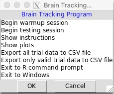

README
================
Richard Sprague
11/26/2018

Seth Roberts was an early self-experimenter who developed this script as
a way to measure “brain reaction time”, which he believed was correlated
with many important aspects of health and well-being.

## How to get started

You’ll need to load this script in an R environment.

Then type this to get started:

``` r
> me()
```

This will open a window with a menu of additional instructions.



Start first with a warmup session and then do the testing session. When
finished, the script will print your results to the R console, or you
can also show plots with many more data points.

## Examples

Seth Roberts published several examples of things he learned from using
this app:

Roberts, S. (2004). Self-experimentation as a source of new ideas: Ten
examples about sleep, mood, health, and weight. Retrieved from
<http://www.escholarship.org/uc/item/2xc2h866>

And here’s a presentation showing more about experiments conducted with
this app:

[](https://player.vimeo.com/video/147673343?title=0&byline=0&portrait=0)

## Technical

Data is kept in the variable `newmath5`. For example, here’s how to show
unique trials:

``` r
library(tidyverse, quietly=TRUE)
load("originalValues.RData")
newmath5 %>% select(condition, when) %>% group_by(condition) %>% filter(n() == 1)
```

    ## # A tibble: 13 × 2
    ## # Groups:   condition [13]
    ##    condition                                                when               
    ##    <chr>                                                    <chr>              
    ##  1 2014-10-28 06:26  morning coffee                         2014-10-28 06:26:19
    ##  2 2014-11-03 08:19 warmup                                  2014-11-03 08:19:46
    ##  3 2014-12-01 06:41  morning coffee (Z=6)                   2014-12-01 06:42:51
    ##  4 2014-12-04 06:39  morning coffee (Z=6.5)                 2014-12-04 06:39:34
    ##  5 2014-12-09 06:33  morning coffee (z=6+)                  2014-12-09 06:33:46
    ##  6 2014-12-24 08:00  morning coffee (z=5.3)                 2014-12-24 08:01:01
    ##  7 2014-12-25 06:51  morning coffee (Z=7)                   2014-12-25 06:52:05
    ##  8 2014-12-26 08:41  morning coffee (Z=5.5)                 2014-12-26 08:41:49
    ##  9 2014-12-27 07:15  morning coffee (Z=6)                   2014-12-27 07:16:09
    ## 10 2014-12-31 06:33  morning coffee (Z=6.5)                 2014-12-31 06:33:48
    ## 11 2015-01-04 06:46  morning coffee (coffee evening before) 2015-01-04 06:47:21
    ## 12 2015-01-06 06:14  morning coffee (Z~7,P=1)               2015-01-06 06:14:58
    ## 13 2017-05-12 07:40  after coffee, shower.                  2017-05-12 07:40:58

## Questions

Join the [Seth Roberts Facebook
Community](https://www.facebook.com/groups/SethRobertsCommunity/).

The original discussions about braintracking occured in Seth Roberts’
[Brain Tracking Google
Group](https://plus.google.com/u/0/communities/114619130176100669530)
(closed since 2014).
